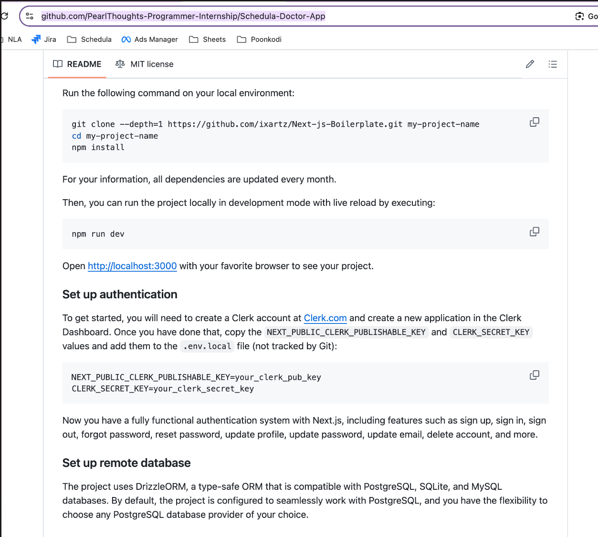
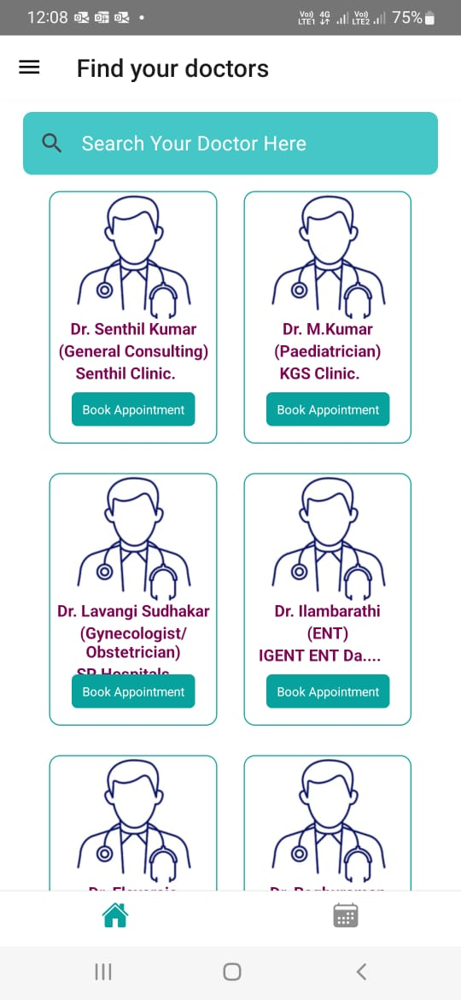

# Task
  - [Set up this app](https://github.com/ixartz/Next-js-Boilerplate/tree/main)
  - Create your own clerk account
  - Shar link or video of you progress
  - 
  - In the boilerplate repo sign-in, singup, forgot password already implemented. 
  - Once setup the application focus on doctor listing page.
  - 
 
Once setup the application focus on doctor listing page.

## What to study on own and exlore today:- 
    - Workflow of github 
    - How to create mock api in next js and show dummy content
    - How different system manages signin/sigup
    - Use of clerk(for sign up and sign in)
    - signin/signup in next js
## Important Links
- [projen](https://github.com/projen/projen)
- [Jio platform also uses Next js](https://builtwith.com/?https%3a%2f%2fwww.jio.com%2f)
- [clerk](https://clerk.com/)
